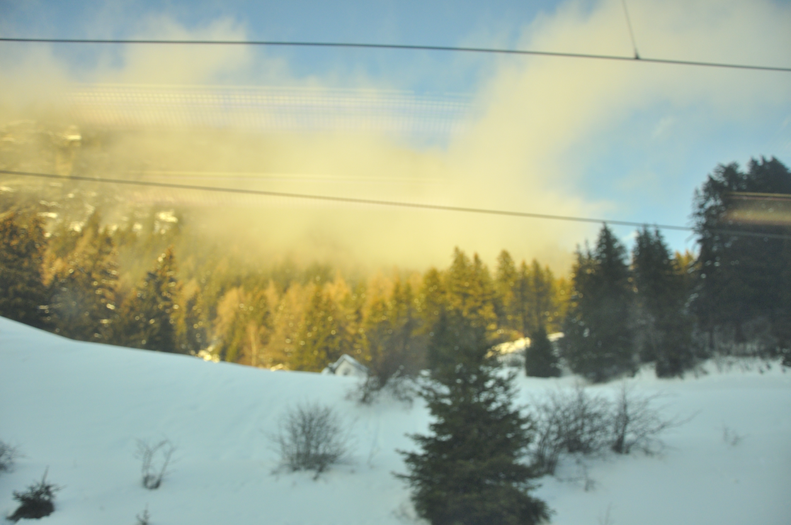
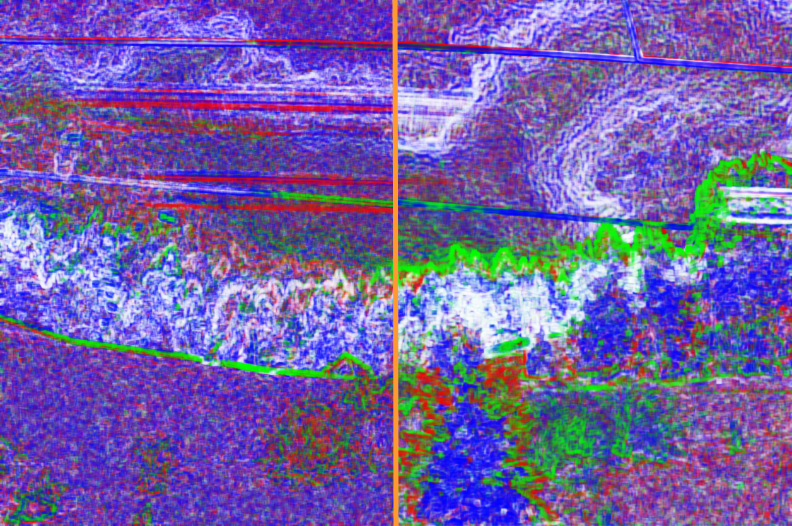
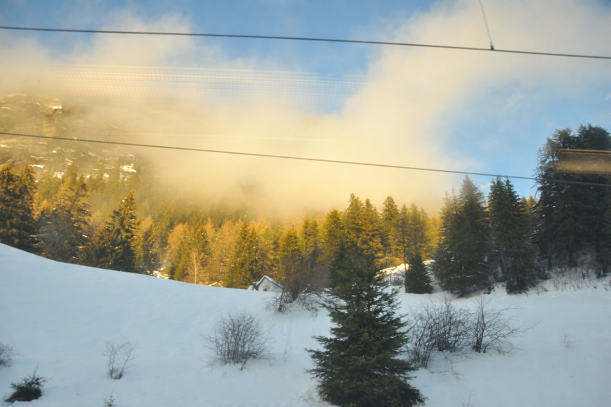
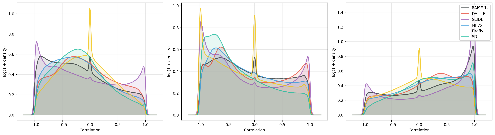
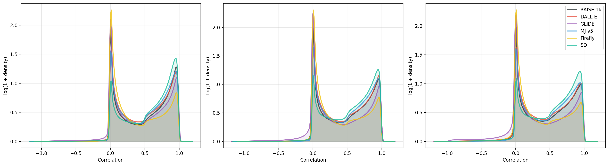
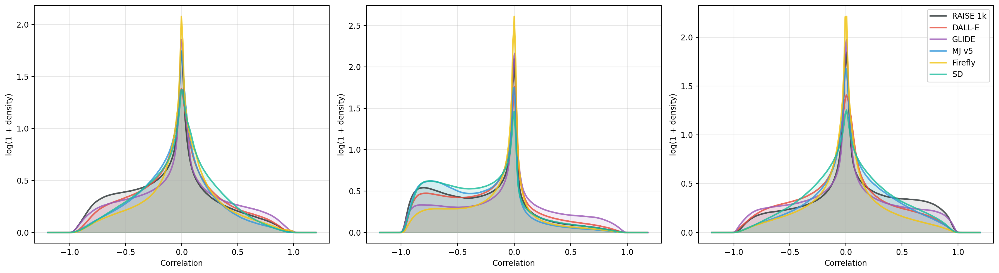
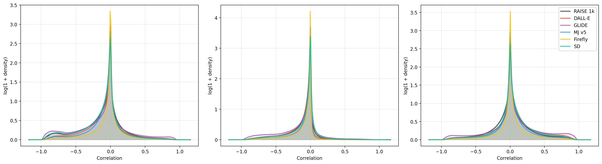

# CHROMA: Detecting AI-Generated Images through Inter-Channel Color-Space Correlations

<p align="center">
  <a href="https://www.python.org/downloads/"></a>
  <a href="https://opensource.org/licenses/MIT"></a>
</p>

Official implementation of the paper **"CHROMA: Detecting AI-Generated Images through Inter-Channel Color-Space Correlations"** (ICPR 2026).

## 🔍 Overview

CHROMA is a lightweight, robust deepfake detector that leverages **inter-channel correlations** as a primary forensic cue. 

While generative models (GANs, Diffusion) effectively match the marginal color distributions of real photographs, they often fail to reproduce the subtle dependencies *between* color channels inherent to physical imaging pipelines. We find that these discrepancies are particularly visible in **Lab** color space correlations, providing a stable signal for detection that generalizes well to unseen generators.

### Key Insight
Perceptual metrics like LPIPS are inconsistent in detecting inter-channel correlation artifacts. By explicitly computing these correlations and feeding them alongside RGB data into a standard backbone (ResNet-50), CHROMA achieves competitive detection performance with a modest training budget.

<p align="center">
  
  
  
</p>
<p align="center">
  <em><strong>Left:</strong> Real image (RAISE-1k). <strong>Center:</strong> Lab correlation map (Real/Gen split), revealing structural artifacts invisible in RGB. <strong>Right:</strong> Visually matched GPT-Image 1 replica.</em>
</p>

## 📉 Distributional Shifts

Our analysis shows that inter-channel correlation statistics exhibit systematic, generator-specific shifts across different color spaces. While RGB and Lab spaces show clear separation, YUV and HSV correlations are less distinct for some generators.

<p align="center">
  <strong>Lab Correlations</strong><br>
  
</p>

<p align="center">
  <strong>RGB Correlations</strong><br>
  
</p>

<p align="center">
  <strong>HSV Correlations</strong><br>
  
</p>

<p align="center">
  <strong>YUV Correlations</strong><br>
  
</p>

## 🛠️ Installation

This project uses [uv](https://github.com/astral-sh/uv) for fast dependency management.

```bash
# Install uv if you haven't already
pip install uv

# Sync dependencies
uv sync
```

## 🚀 Usage

### Feature Composition & Transformations

CHROMA augments RGB images with forensic cues using a flexible feature composer. The transformations are defined in the configuration file.

*   See **[docs/transforms.md](docs/transforms.md)** for a full list of available transformations (e.g., `inter_channel_correlation`, `gradient_magnitude`) and how to configure them.
*   We provide a visualization script to inspect these features:

```bash
uv run scripts/visualize_transforms.py \
  --image images/cover/original.png \
  --config configs/visualization.yaml \
  --output-dir output_viz
```

### Training

To train the model on an A100 (or similar) setup using the default configuration:

```bash
uv run python train.py --config configs/a100_resent50.yaml
```

**Configuration:**
The training config is located at `configs/a100_resent50.yaml`. It defines:
- **Model**: ResNet50 backbone.
- **Features**: RGB input + Inter-channel correlations (RGB & Lab).
- **Data**: Paths to real (LAION, FFHQ, ImageNet) and generated (Synthbuster, etc.) datasets. *Note: You will need to update the data paths in the config to match your local setup.*

### Data & Benchmark

We follow the evaluation protocol and data splits from **[Raising the Bar of AI-generated Image Detection with CLIP](https://github.com/grip-unina/ClipBased-SyntheticImageDetection)** (Cozzolino et al., 2024). Please refer to their repository to download the specific benchmark datasets used for comparison.

### Inference

Run the detector on a folder of images:

```bash
uv run python inference.py \
  --checkpoint path/to/checkpoint.ckpt \
  --config configs/a100_resent50.yaml \
  --input-folder /path/to/test/images \
  --output-csv results.csv \
  --device cuda
```

## 📂 Repository Structure

```
CHROMA/
├── src/chroma/
│   ├── models/       # LightningModule (ResNet50 + Composer)
│   ├── transforms/   # Inter-channel correlation logic (RGB, Lab, etc.)
│   └── data/         # DataModules and datasets
├── configs/          # Training configurations (YAML)
├── metrics/          # Evaluation scripts for standard benchmarks
├── scripts/          # Utility scripts (visualization, etc.)
├── docs/             # Detailed documentation
├── images/           # Visualizations and assets
├── train.py          # Training entry point
├── inference.py      # Inference CLI
└── pyproject.toml    # Project dependencies
```

##  Acknowledgements

This work was partially supported by ANII (Uruguay) and ClusterUY.

